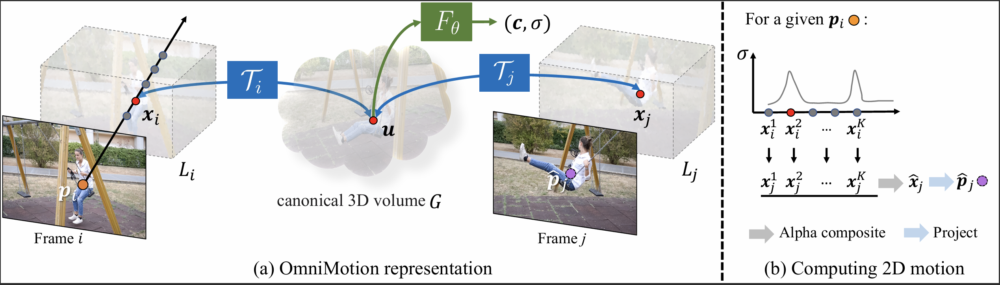

# Tracking Everything Everywhere All at Once

```bash
python train.py --config configs/default.txt --data_dir /home/ekko/datasets/omnimotion/swing

python main_processing.py --data_dir /home/ekko/github/INN/omnimotion/data/pulling --chain

python filter_raft.py --data_dir /home/ekko/github/INN/omnimotion/data/pulling --cycle_th 3
```


## Paper

### 1. Introduction

+ 总的来说，生成既密集又长时间跨度的轨迹仍然是该领域的一个未解问题，面临着三个关键挑战：

    + 在长时间序列中保持准确的轨迹
    
    + 在遮挡情况下跟踪点
    
    + 在时空中保持一致性

+ 在本研究中，我们提出了一种全面的视频运动估计方法，利用视频中的所有信息联合估计每个像素的完整运动轨迹。我们的方法被称为OmniMotion，它使用一种准3D表示法，其中一个标准3D体积通过一组局部标准双射映射到每一帧的局部体积。这些双射作为动态多视角几何的灵活放宽，能够建模相机和场景运动的组合。我们的表示方法保证了循环一致性，并且可以跟踪所有像素，即使在像素被遮挡的情况下（“无所不在，随处可见”）。我们通过对每个视频进行优化，联合求解整个视频的运动“全局一次性”地进行。一旦优化完成，我们的表示可以在视频中的任何连续坐标进行查询，从而得到跨越整个视频的运动轨迹。

    > [!TIP]
    >
    > "Flexible relaxation" 这里指的是对动态多视角几何的一种灵活放宽或宽松的处理方式。具体来说，**放宽**（relaxation）通常是指在某些条件下允许模型或方法更为灵活、简化或不那么严格地遵循传统的几何约束，以便适应更复杂或更广泛的情境。
    >
    > 在此文中，**灵活放宽（flexible relaxation）** 的意思是，传统的动态多视角几何可能要求严格的约束条件（如视角变化或场景运动的具体几何关系），而该方法通过使用局部标准双射（local-canonical bijections）来放松这些条件，从而使得模型能够处理更复杂的动态场景和视角变化，尤其是允许一些程度的误差或不完全的几何约束。这种“灵活放宽”使得模型能够更好地适应各种实际应用中的不确定性和复杂性。

+ 总之，我们提出了一种方法：

    + 为整个视频中的所有点生成全局一致的全长运动轨迹
    + 可以通过遮挡来跟踪点
    + 可以通过摄像机和场景运动的任意组合来处理野外视频

---

### 3. Overview

>
> We propose a test-time optimization approach for estimating dense and long-range motion from a video sequence. Our method takes as input a collection of frames and pairwise noisy motion estimates (e.g., optical flow fields), and uses these to solve for a complete, globally consistent motion representation for the entire video. Once optimized, our representation can be queried with any pixel in any frame to produce a smooth, accurate motion trajectory across the full video. Our method identifies when points are occluded, and even tracks points through occlusions. In the following sections, we describe our underlying representation, dubbed OmniMotion (Sec. 4), then describe our optimization process (Sec. 5) for recovering this representation from a video.

+ 提出了一种测试时优化方法，用于估计视频序列中的密集且远程的运动

+ 以一组帧和成对的噪声运动估计（例如，光流场）为输入，利用这些信息求解出整个视频的完整、全局一致的运动表示
+ 优化后，我们的表示可以通过查询任意帧中的任意像素，生成整个视频中平滑、准确的运动轨迹。我们的方法能够识别点的遮挡情况，甚至可以在遮挡情况下跟踪点



> [!IMPORTANT]
> Method overview. 
> (a) Our OmniMotion representation is comprised of a canonical 3D volume $G$ and a set of bijections $\mathcal{T}_i$ that map between each frame’s local volume $L_i$ and the canonical volume $G$. Any local 3D location $x_i$ in frame $i$ can be mapped to its corresponding canonical location $u$ through $\mathcal{T}_i$ , and then mapped back to another frame $j$ as $x_j$ through the inverse mapping $\mathcal{T}_j^{-1}$. Each location $u$ in $G$ is associated with a color $c$ and density $\sigma$, computed using a coordinate-based MLP $F_\theta$. 
> 
>(b) To compute the corresponding 2D location for a given query point $p_i$ mapped from frame $i$ to $j$, we shoot a ray into $L_i$ and sample a set of points $\{x_i^k\}_{k=1}^K$, which are then mapped first to the canonical space to obtain their densities, and then to frame $j$ to compute their corresponding local 3D locations $\{x_j^k\}_{k=1}^K$.  These points $\{x_j^k\}_{k=1}^K$ are then alpha-composited and projected to obtain the 2D corresponding location $\hat{p}_j$.

---

### 4. OmniMotion representation

如第1节所讨论的，传统的运动表示方法，如成对的光流，无法在物体被遮挡时跟踪其运动，并且在跨多个帧进行匹配时容易产生不一致性。为了在遮挡的情况下仍能获得准确、一致的运动轨迹，我们需要一个全局的运动表示，即一种编码场景中所有点轨迹的数据结构。这样的全局表示之一是将场景分解为一组离散的、深度分离的层[32, 81]。然而，大多数现实场景不能表示为一组固定的、有序层次：例如，考虑一个物体在三维空间中旋转的简单情况。在另一个极端是完全的三维重建，它解开了三维场景几何、相机位姿和场景运动。然而，这个问题是一个极其不适定的问题。因此，我们提出了一个问题：在没有显式的动态三维重建的情况下，我们能否准确跟踪现实世界的运动？

> We answer this question using our proposed representation, OmniMotion (illustrated in Fig. 2). OmniMotion represents the scene in a video as a canonical 3D volume that is mapped to local volumes for each frame through local-canonical bijections. The local-canonical bijections are parametrized as neural networks and capture both camera and scene motion without disentangling the two. As such, the video can be considered as a rendering of the resulting local volumes from a fixed, static camera.

我们通过提出的表示方法——OmniMotion（如图2所示）来回答这个问题。OmniMotion将视频中的场景表示为一个规范的三维体积，并通过局部规范双射将其映射到每一帧的局部体积。局部规范双射由神经网络参数化，并捕捉了相机和场景的运动，而不需要解开二者的关系。因此，可以将视频视为来自固定静态相机的渲染结果。

由于OmniMotion没有显式地解开相机和场景运动的关系，所得到的表示并不是一个物理上精确的三维场景重建。我们称之为准三维表示。通过对动态多视几何的放松，OmniMotion避开了使得动态三维重建变得困难的歧义问题。然而，我们仍然保留了在遮挡情况下进行一致且准确的长期跟踪所需的特性：首先，通过在每个局部帧和规范帧之间建立双射，OmniMotion保证了所有局部帧之间的全局循环一致的三维映射，模拟了现实世界中度量三维参考帧之间的一对一对应关系。其次，OmniMotion保留了所有场景点的信息，这些点投影到每个像素上，并保持它们的相对深度顺序，从而使得即使点暂时被遮挡，也能进行跟踪。

在接下来的章节中，我们将描述我们的准三维规范体积和三维双射，然后说明如何利用它们计算任意两帧之间的运动。

#### 4.1 Canonical 3D volume

我们使用规范体积 G 来表示视频的内容，该体积 G 充当观察场景的三维图集。与 NeRF [44] 一样，我们在 G 上定义了一个基于坐标的网络 Fθ，将每个规范 3D 坐标 u ∈ G 映射到密度 σ 和颜色 c。 G 中存储的密度是关键，因为它告诉我们表面在规范空间中的位置。与 3D 双射一起，这使我们能够跟踪多个帧上的表面以及推理遮挡关系。 G 中存储的颜色允许我们计算优化过程中的光度损失。

#### 4.2 3D bijections

我们定义一个连续双射映射 Ti，它将 3D 点 xi 从每个局部坐标系 Li 映射到规范 3D 坐标系，如 u = Ti(xi)，其中 i 是帧索引。请注意，规范坐标 u 与时间无关，可以将其视为特定场景点或跨时间 3D 轨迹的全局一致“索引”。通过组合这些双射映射及其逆，我们可以从一个局部 3D 坐标帧映射 3D 点到另一个帧：
$$
x_j=\mathcal{T}_{j}^{-1} \circ \mathcal{T}_{i}\left(x_i\right)
$$
双射映射可确保各个帧中 3D 点之间的最终对应关系全部循环一致，因为它们来自同一规范点。

为了允许能够捕捉现实世界运动的表达地图，我们将这些双射参数化为可逆神经网络（INN）。受最近同胚形状建模工作的启发 [35, 49]，我们使用 Real-NVP [14]，因为它的公式简单且具有解析可逆性。 Real-NVP 通过组合称为仿射耦合层的简单双射变换来构建双射映射。仿射耦合层将输入分成两部分；第一部分保持不变，但用于参数化应用于第二部分的仿射变换。

> We modify this architecture to also condition on a per-frame latent code $\psi_i$ [35, 49]. Then all invertible mappings $\mathcal{T}_i$ are parameterized by the same invertible network $M_\theta$, but with different latent codes: $\mathcal{T}_i(\bullet)=M_\theta(\bullet;\psi_i)$.

我们修改此架构以也以每帧潜在代码 ψi 为条件 [35, 49]。然后，所有可逆映射 Ti 由相同的可逆网络 Mθ 参数化，但具有不同的潜在代码：Ti(·) = Mθ(·; ψi)。

#### 4.3 Computing frame-to-frame motion

给定这个表示，我们现在描述如何计算帧 i 中任何查询像素 pi 的 2D 运动。直观上，我们通过射线上的采样点将查询像素“提升”为 3D，使用双射 Ti 和 Tj 将这些 3D 点“映射”到目标帧 j，通过 alpha 合成“渲染”来自不同样本的这些映射的 3D 点，最后“投影”回二维以获得假定的对应关系。

具体来说，由于我们假设相机运动包含在局部规范双射 Ti 中，因此我们只需使用固定的正交相机。 pi 处的射线可定义为 ri(z) = oi +zd，其中 oi = [pi, 0] 且 d = [0, 0, 1]。我们在射线 {xk i } 上采样 K 个样本，相当于将一组深度值 {zk i }K k=1 附加到 pi 上。尽管不是物理相机光线，但它捕获了每个像素处多个表面的概念，并且足以处理遮挡。

接下来，我们通过将这些样本映射到规范空间，然后查询密度网络 Fθ 来获取这些样本的密度和颜色。以第 k 个样本 xk i 为例，其密度和颜色可以写为 (σk, ck) = Fθ (Mθ (xk i ; ψi))。我们还可以将每个样本沿光线映射到帧 j 中相应的 3D 位置 xk j （方程 1）。

现在，我们可以聚合所有样本中的对应关系 xk j 以生成单个对应关系 xˆj。这种聚合类似于 NeRF 中样本点颜色的聚合方式：我们使用 alpha 合成，第 k 个样本的 alpha 值为 αk = 1 − exp(−σk)。然后我们将 x^j 计算为：

使用类似的过程来合成 ck 以获得 pi 的图像空间颜色 Cˆi。然后使用我们的固定正交相机模型投影 xˆj，以生成查询位置 pi 的预测 2D 对应位置 pˆj。